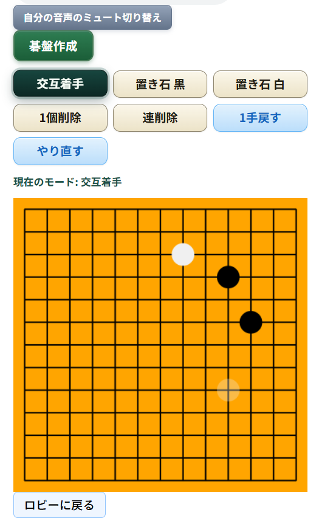

# リアルタイム音声通信碁盤アプリ

## デモ

🔗 [囲碁検討室](https://chat-project-red-waterfall-3034.fly.dev)

## 機能

### リアルタイムチャット（WebSocket）

音声通信（WebRTC P2P）
オンライン碁盤（リアルタイム同期）  
ユーザー認証・プロフィール管理  
プッシュ通知（PWA）：新しい部屋が作成されたら通知

## 使用技術

Backend: Django, Django Channels, Daphne  
Frontend: JavaScript, HTML/CSS, Tailwind CSS  
リアルタイム通信: WebSocket, WebRTC  
プッシュ通知: PWA（Web Push API）  
インフラ: fly.io / Cloudinary（画像）/ Upstash（Redis）/ Neon(データベース)  
データベース: PostgreSQL

## スクリーンショット

## ローカルでの起動方法

bash# 仮想環境作成・有効化  
python -m venv venv  
source venv/bin/activate    # Windows: venv\\Scripts\\activate

## パッケージインストール

pip install -r requirements.txt

## データベースマイグレーション

python manage.py migrate

## 起動

daphne -b 127.0.0.1 -p 8000 chat\_project.asgi:application

